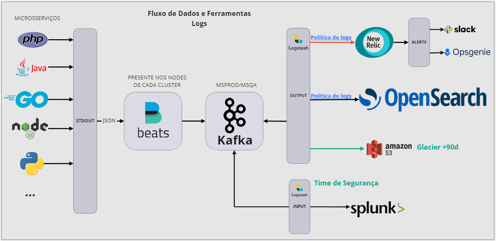
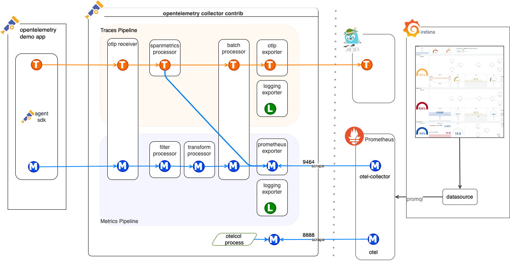
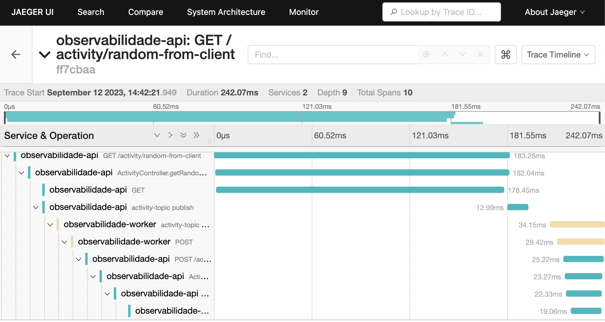
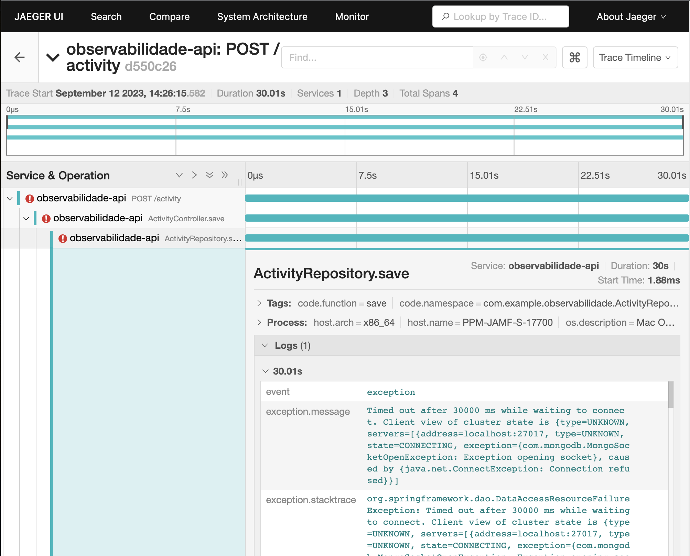

# Observabilidade

Tudo que interage com seu sistema gera um **sinal de telemetria (log, trace, métrica)** com informações relevantes.

Acoplar agentes de cotela, leitura e interpretação desses sinais é o que chamamos de **instrumentalizar o sistema**.

**Observabilidade** é um conceito amplo de municiar um sistema por meio da **instrumentalização**, para visualizar os **sinais** emitidos e com isso constatar as **SLIs**[^1] (indicador de nível de serviço) do sistema e inferir se elas alcançam as **SLOs** (objetivo de nível de serviço) acordadas nas **SLAs** (acordo de nível de serviço).

## Componentes e ferramentas da Observabilidade no 

- Logs
  - Mensagens isoladas com marca temporal (data e hora).
  - Em cada nó do cluster há um agente Filebeat[^2] que lê tudo que é printado nas saídas stdout/stderr (Console) dos hosts, envia tal dado ao Kafka de Log, e que por sua vez é consumido por um S3 de backup e pelas ferramentas de visualização de Log (OpenSeach  [^3], Dynatrace , New Relic ).
- Traces
  - Trilha de passos que uma operação percorre do começo ao fim.
  - Todos os cluster são instrumentados com OpenTelemetry Collector , o qual roteia os Traces para o Jaeger .
- Métricas
  - Qualquer número que mensure algo do sistema. Por exemplo, consumo de CPU, memória ou disco.
  - Todos os cluster são instrumentados com OpenTelemetry Collector , o qual roteia as Métricas para o Prometheus  e do qual será lido pelo Grafana .
- Alertas

<figure style="max-width: 1000px; margin: 0 auto">
  
  <figcaption><a href="https://picpay.atlassian.net/wiki/spaces/SMONITORING/pages/2739506351/Ferramentas">Fluxo de dados de Logs PicPay</a></figcaption>
</figure>

### Links

- Jaeger 
  - https://jaeger-qa.observability.ppay.me/
  - https://jaeger.observability.ppay.me/search
- Grafana 
  - https://grafana-qa-o11y.observability.ppay.me/login
  - https://grafana-prod-o11y.observability.ppay.me/login
  - https://grafana.observability.ppay.me/d/W3TYma74z/rds-atlas-mongodb-info?orgId=1
  - https://grafana.observability.ppay.me/d/HJuakkgnk/rds-cloudwatch-monitoring?orgId=1&var-source=Banking%20PROD&var-region=us-east-1&var-rds=jd-boa-jdccs-db-prod&from=now-30m&to=now
- OpenSeach 
  - https://o11y-logs-qa.observability.ppay.me/_dashboards/app/home#/
  - https://opensearch.observability.ppay.me/_dashboards/app/home#/
- Dynatrace 
  - https://dvh67605.live.dynatrace.com/ui/dashboards?gtf=-2h&gf=all
  - https://oxq68941.live.dynatrace.com/ui/dashboards?gtf=-2h&gf=all

### Demandas e ajuda do time de Observabilidade
- Slack: `#observability-team`
- Confluence: https://picpay.atlassian.net/wiki/spaces/SMONITORING/pages/2462908559/Central+de+ajuda

## OpenTelemetry (OTEL) 

É o projeto da Cloud Native Computing Foundation (CNCF) para servir como um framework de criação e gerenciamento de dados de telemetria.

Dentre tantas outras coisas[^4], o projeto OTEL é composto de:

- Bibliotecas, APIs e SDKs que se integram à aplicação, criam e exportam os dados de telemetria de todos os recursos detectados como SO, runtime, host, serviço, etc.[^5]
- Um proxy chamado de OpenTelemetry Collector que recebe, processa e exporta dados de telemetria, permitindo assim que a instrumentação das aplicações sejam desacopladas de um fornecedor específico.[^6]
  - application -> agent (opentelemetry-javaagent.jar) -> **collector** -> backend (Prometheus, Jaeger)
- Protocolo de troca de dados de telemetria entre os componentes. OTLP é o nome.[^7]
- Estabelece, formalmente, uma convenção semântica de nomenclatura para dados de telemetria.[^8]

<figure style="max-width: 1000px; margin: 0 auto">
  
  <figcaption><a href="https://opentelemetry.io/docs/demo/collector-data-flow-dashboard/#data-flow-overview">Fluxo de dados de telemetria</a></figcaption>
</figure>

### Sinais emitidos

- Logs
  - Mensagens isoladas com marca temporal (data e hora).
  - MDC na auto-instrumentação (trace_id, span_id, trace_flags)[^9]
    - `logging.pattern.level = trace_id=%mdc{trace_id} span_id=%mdc{span_id} trace_flags=%mdc{trace_flags} %5p`
- Traces
  - Trilha/cascata/corrente/sequência de passos que uma operação percorre do começo ao fim. Cada "passo" é chamado, formalmente, de `span`.
  - Cada `span` possui um **nome**, **data e hora de início e fim**, **eventos (logs)**, se ocorrerem, e **atributos** específicos e relevantes como, por exemplo, os atributos `http.method=GET, http.target=/cart, http.status_code=200` podem estar presentes em um `span` de requisição HTTP, além dos atributos que relacionam de forma hierárquica todos os `spans` com o `trace` em questão, - `trace_id`, `span_id` e `parent_id` (ID do `span` pai) - engendrando assim a **Propagação de Contexto**. Os atributos são configuráveis, porém existe a **convenção semântica**[^10] de atributos comuns e conhecidos como `http.response.status_code`, `http.request.method`, etc.
  - Cada `span` também possui um **status** (`Unset`, `Ok`, `Error`) e um **kind** (`Client`, `Server`, `Internal`, `Producer`, `Consumer`).[^11]
  - Amostragem (**Head** VS **Tail**)[^12].

<figure style="max-width: 1000px; margin: 0 auto">
  
  <figcaption><a href="https://opentelemetry.io/docs/instrumentation/java/manual/#context-propagation">Propagação de contexto de OTEL Trace</a></figcaption>
</figure>

```json
# Headers de mensagem Kafka

{
  "spring_json_header_types": "{\"traceparent\":\"java.lang.String\",\"contentType\":\"java.lang.String\",\"target-protocol\":\"java.lang.String\"}",
  "traceparent": "00-20600b06b9eedbe8635a6076be0d4914-2419a665722fa5be-01",   <<<<< aqui >>>>>
  "contentType": "application/json",
  "target-protocol": "kafka"
}
```

```console
# Log de requisição OpenFeign

[ActivityClient#getRandom] ---> GET http://www.boredapi.com/api/activity HTTP/1.1
[ActivityClient#getRandom] traceparent: 00-c8d3fa465e86ce153a47a6a6c46519a0-73bb5707992688a1-01       <<<<< aqui >>>>>
[ActivityClient#getRandom] ---> END HTTP (0-byte body)
```

<figure style="max-width: 1000px; margin: 0 auto">
  
  <figcaption><a href="https://opentelemetry.io/docs/specs/otel/trace/exceptions/">Exceptions em OTEL Trace</a></figcaption>
</figure>

<figure style="max-width: 1000px; margin: 0 auto">
  
  <figcaption><a href="https://opentelemetry.io/docs/concepts/sampling/">Amostragem de OTEL Trace</a></figcaption>
</figure>

```yaml
# configuração de amostragem do tipo Tail no otel-collector.yaml

processors:
  tail_sampling:
    decision_wait: 10s
    num_traces: 100
    expected_new_traces_per_sec: 10
    policies:
      [
        {
          name: errors-policy,
          type: status_code,
          status_code: { status_codes: [ERROR] }
        },
        {
          name: randomized-policy,
          type: probabilistic,
          probabilistic: { sampling_percentage: 25 }
        },
        {
          name: latency-policy,
          type: latency,
          latency: { threshold_ms: 5000 }
        },
        {
          name: regex-attribute-policy,
          type: string_attribute,
          string_attribute: { key: http.status_code, values: [4\d\d, 5\d\d], enabled_regex_matching: true }
        }
      ]
```

- Metricas
  - Mede alguma coisa no sistema e o exporta de forma **agregada** segundo as **convenções semânticas**.[^13]
  - **Counter**, **UpDownCounter**, **Gauge** e **Histogram** são os tipos de instrumentos de medição.
  - Métricas possuem atributos que conferêm a ela **dimensões** de existência, significado e singularidade, por exemplo, `runtime.thread.count{daemon=true/false}`.
  - Também obedecem regras de nomeação conforme o tipo de instrumento de medição como, por exempo, regras de **nome no plural ou usar `count`**, **unidade de medida no nome**, palavras-chave no nome como `count`, `limit`, `usage`, `utilization`, etc.

```java
var meter = openTelemetry.getMeter("cerc");

meter
  .upDownCounterBuilder("cerc_sent_file_count")
  .buildWithCallback(measurement -> measurement.record(1, Attributes.of(AttributeKey.stringKey("file_name"), "AP001")));
```

[^1]: SLA, SLO, SLI (https://www.atlassian.com/br/incident-management/kpis/sla-vs-slo-vs-sli)
    - **SLA**, Service Level Agreement ou Acordo de Nível de Serviço são os acordos que o provedor e cliente fazem a respeito das funcionalidades, disponibilidade, capacidade de resposta de um sistema, etc.
    - **SLO**, Service Level Objectives ou Objetivos de Nível de Serviço são as métricas de referência ou métricas a serem cumpridas pelo provedor a fim de assegurar o cumprimento da **SLA**. Exemplo, disponibilidade 95% do tempo, respostas em menos de 1 segundo, etc.
    - **SLI**, Service Level Indicators ou Indicadores de Nível de Serviço são as métricas que de fato o sistema está entregando. Precisam se igualar ou superar as métricas acordadas na **SLO** para que o sistema cumpra com a **SLA**.

[^2]: `Filebeat` é um agente da família `beat` da **Elasticsearch B.V**.
    - https://techlipe.medium.com/um-entendimento-justo-e-prático-dos-beats-da-elastic-introdução-e-filebeat-parte-1-c93e8efa3a53
    - https://www.elastic.co/pt/beats/filebeat/

[^3]: Links OpenSeach 
    - https://aws.amazon.com/what-is/elk-stack/
    - https://aws.amazon.com/what-is/elasticsearch/
    - https://aws.amazon.com/what-is/opensearch/
    - https://opensearch.org/
    - https://www.elastic.co/elastic-stack

[^4]: Componentes OTEL
    - https://opentelemetry.io/docs/concepts/components/
    - https://opentelemetry.io/docs/specs/otel/overview/

[^5]: APIs e SDKs OTEL
    - https://opentelemetry.io/docs/concepts/instrumentation/
    - https://opentelemetry.io/docs/concepts/sdk-configuration/
    - https://opentelemetry.io/docs/instrumentation/java/
    - https://opentelemetry.io/ecosystem/registry/?language=java&component=all

[^6]: OTEL Collector
    - https://opentelemetry.io/docs/collector/
    - https://opentelemetry.io/docs/demo/collector-data-flow-dashboard/#data-flow-overview
    - https://opentelemetry.io/docs/demo/architecture/

[^7]: Protocolo OTEL, OTLP
    - https://opentelemetry.io/docs/specs/otlp/

[^8]: Convenções semânticas OTEL
    - https://opentelemetry.io/docs/concepts/semantic-conventions/

[^9]: Logger MDC na auto-instrumentação do OTEL
    - https://github.com/open-telemetry/opentelemetry-java-instrumentation/blob/main/docs/logger-mdc-instrumentation.md

[^10]: Convenção semântica OTEL Trace
    - https://opentelemetry.io/docs/specs/otel/trace/semantic_conventions/

[^11]: OTEL Trace Status e Kind
    - https://opentelemetry.io/docs/concepts/signals/traces/#span-status
    - https://opentelemetry.io/docs/concepts/signals/traces/#span-kind

[^12]: Amostragem de OTEL Trace
    - https://opentelemetry.io/docs/concepts/sampling/
    - https://opentelemetry.io/docs/concepts/sdk-configuration/general-sdk-configuration/#otel_traces_sampler
    - Amostragem na aplicação
      - https://opentelemetry.io/docs/specs/otel/trace/sdk/#sampling
    - Amostragem no OTEL Collector
      - https://opentelemetry.io/blog/2022/tail-sampling/
      - https://github.com/open-telemetry/opentelemetry-collector-contrib/tree/main/processor/tailsamplingprocessor
      - https://www.youtube.com/watch?v=l4PeclHKl7I

[^13]: OTEL Métricas
    - https://opentelemetry.io/docs/concepts/signals/metrics/
    - https://opentelemetry.io/docs/instrumentation/java/manual/#metrics
    - https://opentelemetry.io/docs/specs/otel/metrics/semantic_conventions/
